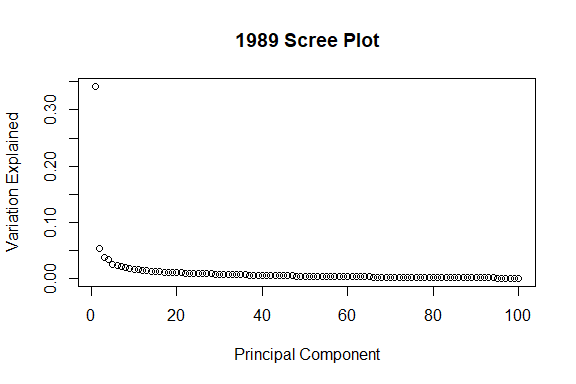
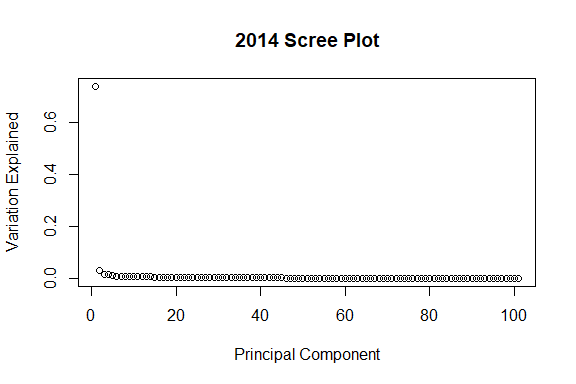
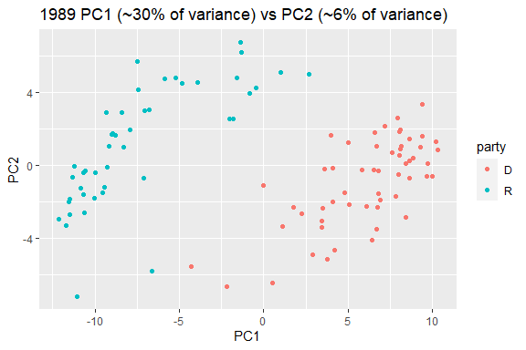
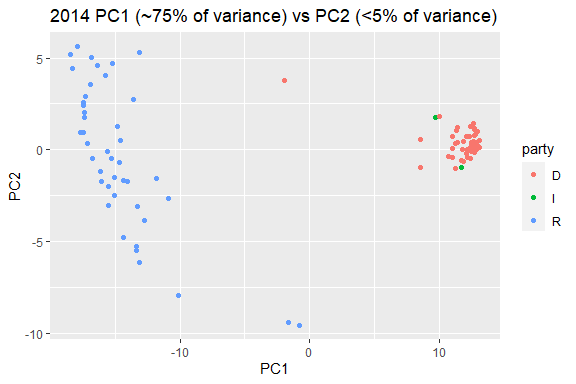
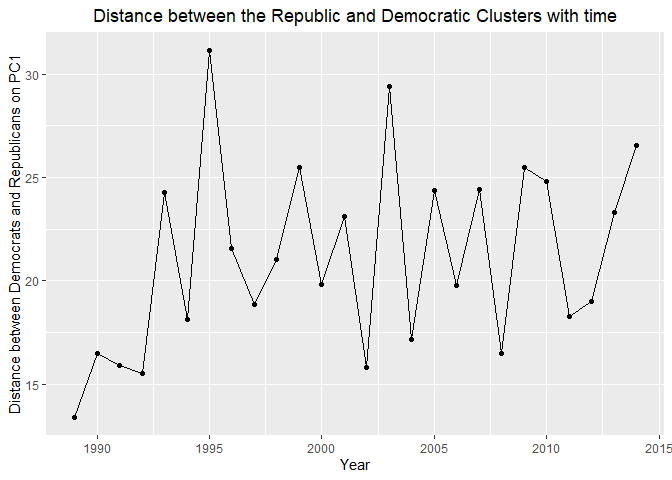
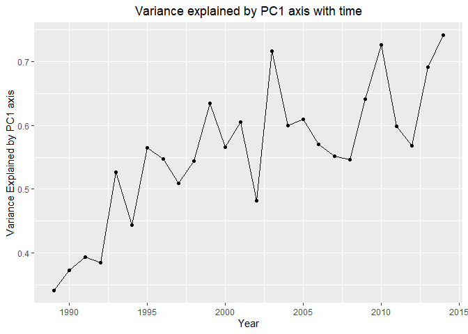
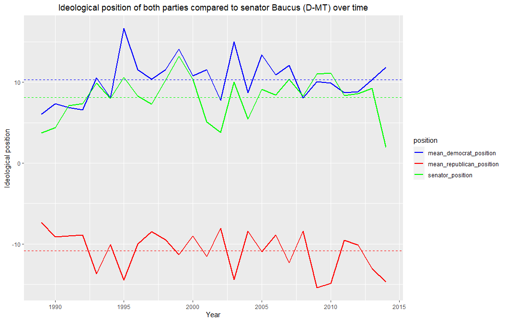
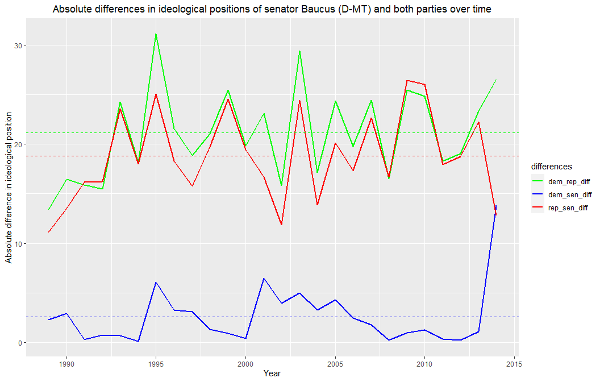

STAT-S 670: Mini Project 2
================
Parth Ravindra Rao, Anuj Anil Patel, Brendan McShane
29/03/2022

``` r
library(magrittr)
library(tidyverse)
```

    ## Warning: package 'tidyverse' was built under R version 4.1.2

    ## Warning: package 'tibble' was built under R version 4.1.2

    ## Warning: package 'tidyr' was built under R version 4.1.2

    ## Warning: package 'readr' was built under R version 4.1.2

    ## Warning: package 'purrr' was built under R version 4.1.2

    ## Warning: package 'dplyr' was built under R version 4.1.2

    ## Warning: package 'forcats' was built under R version 4.1.2

``` r
library(ggbiplot)
```

    ## Warning: package 'plyr' was built under R version 4.1.2

``` r
library(ggrepel)
```

    ## Warning: package 'ggrepel' was built under R version 4.1.2

``` r
library(plyr)
```

# Introduction

Many people have seemingly noticed increasing polarization between
parties in modern American politics, and theorize that the middle ground
is being hollowed out and more moderate politicians are becoming more
and more few and far between. In this project we aim to come to a more
concrete conclusion to this hypothesis, and see if we can backup the
claim (or the counterclaim) with data. We do this by analyzing the
congressional senate voting records from 1989 to 2014, and applying
principal component analysis to see if a senators vote is becoming more
readily predictable simply from looking at his political affiliation.

## Part 1: Polarization in two years

``` r
members1989 = read.csv("congress/1989/members.csv")
votes1989 = read.csv("congress/1989/votes.csv")
members2014 = read.csv("congress/2014/members.csv")
votes2014 = read.csv("congress/2014/votes.csv")

recode_votes = function(vote) {
  if(is.na(vote)) {
    return(0)
  } else if(vote == "Yea") {
    return(1)
  } else if(vote == "Nay") {
    return(-1)
  } else {
    return(0)
  }
}
```

``` r
# 1989
votes_numeric1989 = data.frame(apply(votes1989[,-1], 1:2, recode_votes))
votes_numeric1989$id = votes1989$id
joined1989 = join(members1989, votes_numeric1989, by="id")
                  
out_prcomp1989 = prcomp(joined1989[,7:ncol(joined1989)])


# 2014
votes_numeric2014 = data.frame(apply(votes2014[,-1], 1:2, recode_votes))
votes_numeric2014$id = votes2014$id
joined2014 = join(members2014, votes_numeric2014, by="id")

out_prcomp2014 = prcomp(joined2014[,7:ncol(joined2014)])
```

### Figure 1.1

``` r
plot(out_prcomp1989$sdev^2 / sum(out_prcomp1989$sdev^2),
     main='1989 Scree Plot',
     xlab='Principal Component',
     ylab='Variation Explained')
```

<!-- -->

### Figure 1.2

``` r
plot(out_prcomp2014$sdev^2 / sum(out_prcomp2014$sdev^2),
     main='2014 Scree Plot',
     xlab='Principal Component',
     ylab='Variation Explained')
```

<!-- -->

``` r
members_and_scores1989 = data.frame(members1989, out_prcomp1989$x)
members_and_scores2014 = data.frame(members2014, out_prcomp2014$x)
```

From these two plots we can clearly tell the first principal component
completely dominates the variance, it takes up by far the largest
proportion in both graphs. The difference from 1989 to 2014 is
staggering, though. It jumps from accounting for a little under 35% of
the variance to over 70%. The first principal component accounting for a
significantly larger portion of the variation in 2014 as compared to
1989 is reflected in the following plots.

### Figure 1.3

``` r
ggplot(members_and_scores1989, aes(x = PC1, y = PC2)) +
  geom_point(aes(color = party)) +
  ggtitle('1989 PC1 (~30% of variance) vs PC2 (~6% of variance)')
```

<!-- -->

### Figure 1.4

``` r
ggplot(members_and_scores2014, aes(x = PC1, y = PC2)) +
  geom_point(aes(color = party)) +
  ggtitle('2014 PC1 (~75% of variance) vs PC2 (<5% of variance)')
```

<!-- -->

Please note that the colors are reversed from the traditional color
scheme of American politics, and democrats are represented by red dots
while conservatives are represented by blue. In the 1989 plot, PC1
values range from around -12 to around 10, while PC2 values mostly only
cover a range of -4 to 6. However without observing the axis labels the
plot would look as if the two variables are largely evenly spread out.
Outside of two republican outliers, though, it should be noted that the
two groups of points are linearly separable if we utilize both PC1 and
PC2 axii.

In the 2014 plot we can clearly see how PC1 accounts for a significantly
larger portion of the variance than PC2 (which in turn accounts for a
larger portion than PC3, PC4, etc..). There is a MUCH larger gap between
parties in PC1. We can draw a vertical line on PC1=0 and VERY
comfortably predict if the senator is democrat or republican based on
whether they fall on the left or right side of that line, respectively
(except for 1 democrat outlier, there’s also 2 conservative outliers
that come relatively close to crossing that line). Interestingly enough
it looks like one of the reasons PC2 accounts for so much less of the
variance is the democrats are so closely knit and have almost next to no
difference in their values for PC1 and PC2. The gap between parties on
PC1 is relatively large. Republicans are pretty spread out along PC2,
while democrats remain near identical along that axis as well. The thing
to note here is that the two categories of senator are linearly
separable on this plot using strictly PC1, while in 1989 we had to use
both PC1 and PC2. On top of that, we can eyeball the two graphs and
easily tell that the ratio of within party variance as compared to
between party variance gets much, much smaller over time.

What does this all mean? This implies the two parties are much more
polarized now than they were in 1989, and we can much more reliably and
easily predict how any given senator is going to vote on a bill based
off of their party affiliation. The within party variance getting much
smaller with respect to between party variance suggests more of the
same, members of the two parties are voting more and more similar to
each other and more dissimilar to members of the other party.

In the 1989 plot, we can see that the two parties essentially land on a
single democratic/conservative axis if we take a linear combination of
PC1 and PC2 (imagine a line with an intercept of 0 and a slope of -1).
There will be a little overlap, but that’s okay if we take into
consideration that we expect there to be less political polarization in
1989 as compared to 2014. In the 2014 case, we don’t even need both
principal components to put the two parties on a similar axis, if we
just use PC1 and put a decision boundary at PC1=0, both parties are
separated by that boundary (except for the single aforementioned
democratic outlier).

## Part 2: Polarization over time

In order to analyse polarization with time, we first plot the distance
between the the average scores of the democrats and the republicans
across the PC1 axis. The graphed scores clearly do not follow any
particular increasing or decreasing trend. We cannot conclusively state
that polarization increases over time. We do notice some sudden increase
for particular years such as 1995, 1999 and 2003.

``` r
score.df = data.frame(Year = integer(), Score = double(), Variance = double(), stringsAsFactors=FALSE)

for(i in 1989:2014){
  year = i
  members = read.csv(paste("congress/",year,"/members.csv",sep = ""))
  votes = read.csv(paste("congress/",year,"/votes.csv",sep = ""))
  joined = join(members, votes, by = "id")
  votes = joined[,(-1:-6)]
  members = joined[,1:6]
  
  votes_numeric = apply(votes, 1:2, recode_votes)
  
  ## PCA
  out_prcomp = prcomp(votes_numeric, scale = FALSE)
  members_and_scores = data.frame(members, out_prcomp$x)
  
  # Taking max of distance between the average between the two Republicans and the Democrats along the PC1 axis
  score = max(sum(subset(members_and_scores, party=='R', select = PC1))/nrow(subset(members_and_scores, party=='R', select =  PC1)) - sum(subset(members_and_scores, party=='D', select = PC1))/nrow(subset(members_and_scores, party=='D', select = PC1)), sum(subset(members_and_scores, party=='D', select = PC1))/nrow(subset(members_and_scores, party=='D', select = PC1)) - sum(subset(members_and_scores, party=='R', select = PC1))/nrow(subset(members_and_scores, party=='R', select = PC1)))
  
  var = out_prcomp[1]$sdev[1]^2 / sum(out_prcomp$sdev^2)
  
  score.df = rbind(score.df, data.frame(Year = year, Score = abs(score), Variance = var))
}
```

### Figure 2.1

``` r
ggplot(score.df, aes(x=Year, y=Score)) + geom_point() + geom_line() +
  labs(x='Year', y='Distance between Democrats and Republicans on PC1', title='Distance between the Republic and Democratic Clusters with time') +
  theme(plot.title = element_text(hjust = 0.5))
```

<!-- -->

We then plot the variance explained by PC1 axis across the years. We
know that the PC1 axis best explains the polarization. This would
suggest that as the variance explained by PC1 axis increases, the axis
better explains our model, in turn making our data linearly separable
using only one axis. This would suggest that the polarization between
the parties increases. Looking at our plot we see that while there are
slight variations, the general trend of the plots is increasing. This
would suggest a general increase in polarization between the liberal and
conservative ideologies.

### Figure 2.2

``` r
ggplot(score.df, aes(x=Year, y=Variance)) + geom_point() + geom_line() +
  labs(x='Year', y='Variance Explained by PC1 axis', title='Variance explained by PC1 axis with time') +
  theme(plot.title = element_text(hjust = 0.5))
```

<!-- -->

Analyzing the crests and the troughs, we notice that similar to our
previous graph, in the years 1995, 1999 and 2003 an increase in
polarization is observed. Similarly, 2010 and 2014 have some of the
highest variances and thus some of the highest polarization. If we look
at both plots carefully, we observe that the years with the increase in
polarization generally are the years before national elections take
place. Elections took place in years 1996, 2000 and 2004, and our plots
show increased polarization for 1995, 1999 and 2003. We know that the
period before elections is a crucial time for political parties to
campaign. This desire to gain mass acceptance may cause senators to
resort to means such as negative advertising in order to fuel the
dichotomy of the voting class. It is highly likely that the increase in
polarization right before the election years are a direct result of the
need to gain support of the people. Contrary to this hypothesis though,
we see that there isn’t any particular rise in polarization before the
2008 elections. While the concrete reason for this is unclear, we
suspect that this could be due to the 2008 recession. During a time like
this, we can presume that most senators, irrespective of party,
generally would be unhappy with the current government and on some
level, would be united in their animosity towards the administration.

## Part 3: Ideological position of one senator

Finally, we’ll analyze the absolute changes in the ideological position
of the two parties and also the two parties’ positions relative to one
sentator.  
We choose senator Max Baucus, a democrat from Montana, as he is one of
the senators who has served in all of the years from 1989 to 2014 from
the same party and state.  
The ideological positions are quantified by doing PCA on the voting
records for each year, and selecting the value of the first principal
component for each senator. This is justified since we know that the
majority of the variance is explained by the first principal component
in most years.  
For each party, the mean PC1 of all senators of that party is calculated
per year and plotted. For senator Baucus, it’s simply his PC1 score for
each year. The dashed horizontal lines indicate the overall means of the
respective lines.

``` r
reps <- c()  #stores the mean ideological position of all Republicans per year
dems <- c()  #stores the mean ideological position of all Democrats per year
sen <- c()   #stores the ideological position of the senator of interest per year
years <- seq(1989,2014)

for (year in years) {
  #read the data sets
  members = read.csv(paste("congress/",year,"/members.csv",sep = ""))
  votes = read.csv(paste("congress/",year,"/votes.csv",sep = ""))
  
  #match names and orders for members and votes
  joined = join(members, votes, by = "id")
  members = joined[,1:6]
  votes = joined[,(-1:-6)]
  
  votes_numeric = apply(votes, 1:2, recode_votes)
  #PCA
  out_prcomp = prcomp(votes_numeric)
  members_and_scores = data.frame(members, out_prcomp$x)
  reps <- c(reps, mean(subset(members_and_scores, party=='R', select = PC1)$PC1) )
  dems <- c(dems, mean(subset(members_and_scores, party=='D', select = PC1)$PC1) )
  sen_id <- 'S127'
  sen_party <- subset(members, id==sen_id , select = party)$party
  sen <- c(sen, subset(members_and_scores, id==sen_id , select = PC1)$PC1 )
}
sen_name <- subset(members_and_scores, id==sen_id , select = display_name)$display_name
ideologies <- data.frame(Year=years, mean_republican_position = abs(reps)*(-1), mean_democrat_position = abs(dems), 
                         senator_position = abs(sen)*(if (sen_party=='D') 1 else (-1)), dem_rep_diff = abs(reps-dems),
                         dem_sen_diff = abs(dems-sen), rep_sen_diff = abs(reps-sen))
#Plot 3.1
mean_lines <- ideologies %>% pivot_longer(cols=contains("position"), names_to="position")
```

### Figure 3.1

``` r
ggplot(mean_lines, aes(x = Year, y = value, color = position)) +
  geom_line(size=1) +
  scale_color_manual(values = c("blue","red","green")) +
  geom_hline(yintercept=mean(ideologies$mean_democrat_position), linetype="dashed", color="blue") +
  geom_hline(yintercept=mean(ideologies$mean_republican_position), linetype="dashed", color="red") +
  geom_hline(yintercept=mean(ideologies$senator_position), linetype="dashed", color="green") +
  ylab("Ideological position") +
  ggtitle(paste("Ideological position of both parties compared to senator", sen_name, "over time")) +
  theme(plot.title = element_text(hjust = 0.5))
```

<!-- -->

Senator Baucus being a democrat obviously places him in and around the
democrat line throughout but there are subtle changes over time. The
democrats go slightly higher on the axis while senator Baucus’ position
doesn’t change much over time. This suggests that the parties are more
to blame for the increased polarization. This is especially clear in the
years where the democrat line shows spikes and the senator doesn’t
deviate from his previous position by the same magnitude. The two
parties do seem to show some evidence of polarization as they start off
relatively close to each other but the gap increases in the following
years, though it is not completely conclusive.  
Next, we plot the absolute difference in ideological position between
the senator and both parties over the years, and also between the two
parties.

### Figure 3.2

``` r
#Plot 3.2
diff_lines <- ideologies %>% pivot_longer(cols=contains("diff"), names_to="differences")
ggplot(diff_lines, aes(x = Year, y = value, color = differences)) +
  geom_line(size=1) +
  scale_color_manual(values = c("green","blue","red")) +
  geom_hline(yintercept=mean(ideologies$dem_rep_diff), linetype="dashed", color="green") +
  geom_hline(yintercept=mean(ideologies$dem_sen_diff), linetype="dashed", color="blue") +
  geom_hline(yintercept=mean(ideologies$rep_sen_diff), linetype="dashed", color="red") +
  ylab("Absolute difference in ideological position") +
  ggtitle(paste("Absolute differences in ideological positions of senator", sen_name, "and both parties over time")) +
  theme(plot.title = element_text(hjust = 0.5))
```

<!-- -->

The green line provides further proof that the gap has increased between
the two parties but most of it is down to the first few years in this
dataset. The gap has remained in and around its mean line since then,
with the spikes down to the pre-election years as reported earlier. The
red valleys are significantly deeper than the green valleys meaning that
the senator has often voted closer to “neutral” compared to his party
(Democrats) as a whole.  
The last year’s data point is quite interesting as we see the red and
blue lines intersect. This means that in 2014, senator Baucus was
equally as far away from the Democrats’ ideological position as he was
from the Republicans’. Granted, this is just from one year’s voting
records, but it’s a huge difference from the other years especially when
we consider that the inter party difference increased even further in
2014.

# Conclusion

All the cumulative evidence points towards increasing polarization in
American politics over time. First, we saw that the variance explained
by first principal component doubles from 1989 to 2014, ending up at
70%. The PCA clusters of the two parties shrink and are easily
distinguishable over time. We also noticed sharp increases in
polarization in specific years, namely the years immediately preceding a
presidential election. Finally, we analyzed how the two parties change
relative to one senator, Max Baucus, which revealed findings consistent
with earlier that the ideological gap between parties has increased,
even though senator Baucus seems to have become more moderate as time
has gone on. To summarize, our analysis agrees with the belief that
political spectrum in the United States is being hollowed out.
